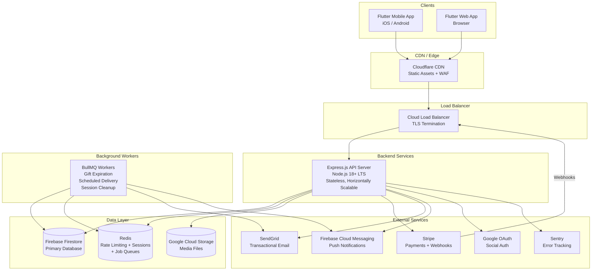
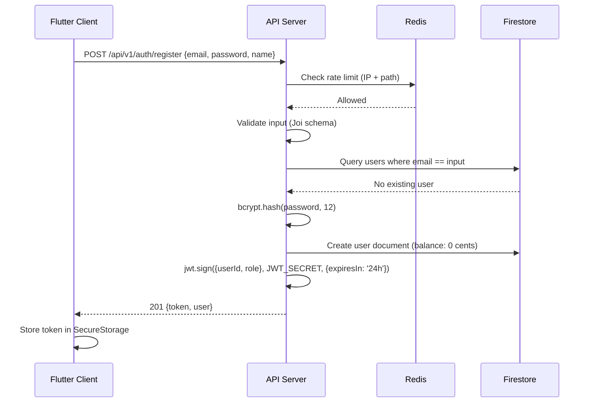
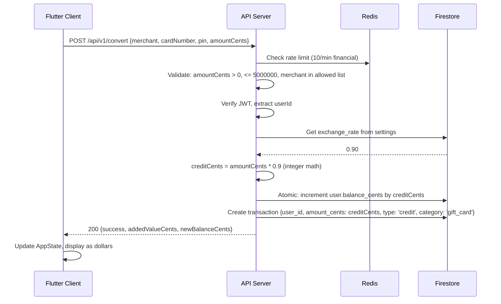
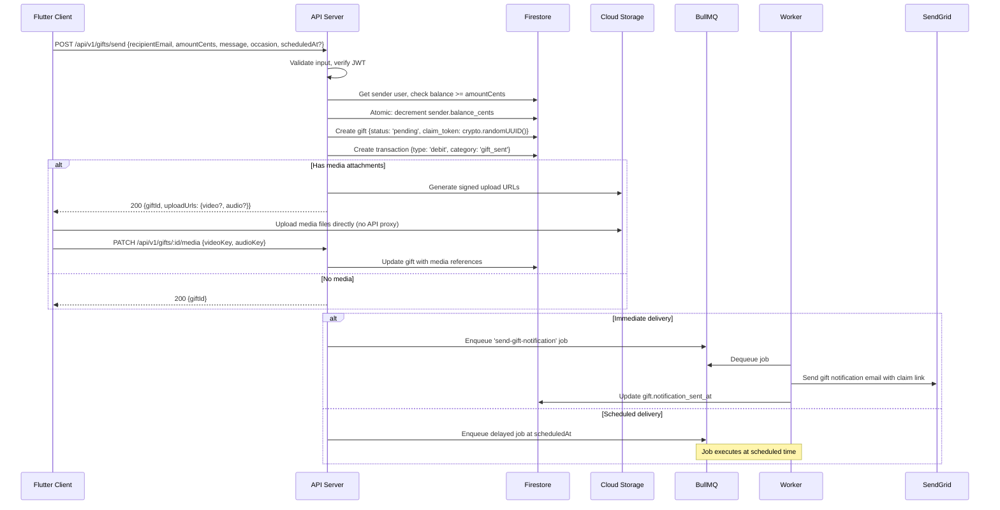
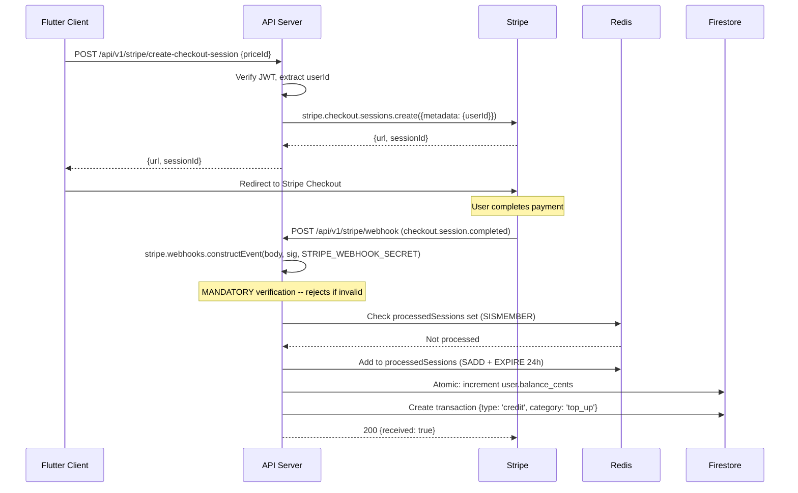

# UniCredit (Stitch) -- System Architecture

**Version:** 3.0
**Date:** 2026-03-17
**Status:** Draft
**Author:** Solution Architect Agent

---

## 1. High-Level Architecture



---

## 2. Architecture Principles

1. **Stateless Backend** -- No in-memory state. All session data, rate limits, and caches live in Redis. Any API server instance can handle any request. This enables horizontal scaling.

2. **Integer Currency Throughout** -- All monetary values are stored and transmitted as integer cents (e.g., `$12.50` = `1250`). Conversion to display format happens exclusively in the presentation layer. No floating-point arithmetic touches money.

3. **Defense in Depth** -- Security is layered: WAF at the edge, TLS termination at the load balancer, Helmet.js headers in Express, CORS locked to known origins, JWT authentication on all protected routes, IDOR protection on all user-scoped resources, input validation on all endpoints, and audit logging on all admin actions.

4. **Fail-Secure** -- Missing secrets cause a hard crash at startup, not silent fallback. Stripe webhook verification is mandatory in production. CORS rejects unknown origins. Rate limiting defaults to deny.

5. **Separation of Concerns** -- The monolithic `server.js` is decomposed into routes, controllers, services, middleware, and validators. Each module has a single responsibility and testable interface.

6. **Event-Driven Side Effects** -- Gift notifications, scheduled deliveries, and expiration checks are handled by background jobs via BullMQ + Redis, not inline in request handlers. This keeps API response times fast and makes side effects retryable.

---

## 3. Component Breakdown

### 3.1 Frontend (Flutter)

| Component | Responsibility |
|-----------|---------------|
| **Screens** | Page-level widgets: Login, Dashboard, Convert, Gift Send, Gift Reveal, Add Credit, Admin, Profile |
| **Components** | Reusable UI widgets: BalanceCard, TransactionList, MerchantGrid, OccasionGrid, MediaCapture |
| **Services** | API client (HTTP + auth headers), local storage, notification handler |
| **State Management** | Provider + ChangeNotifier (current), with migration path to Riverpod for complex flows |
| **Theme** | Centralized design tokens: AppColors, AppSpacing, AppRadius, AppTextStyles |
| **Models** | Typed data classes: User, Transaction, Gift, Merchant, Settings |

### 3.2 Backend (Node.js + Express)

| Module | Responsibility |
|--------|---------------|
| **Routes** | HTTP method + path registration, request delegation to controllers |
| **Controllers** | Request parsing, response formatting, error handling delegation |
| **Services** | Business logic: AuthService, WalletService, GiftService, ConversionService, AdminService, NotificationService |
| **Middleware** | Cross-cutting: auth, CORS, rate limiting, request logging, error handler, input validation |
| **Validators** | Joi/Zod schemas for every endpoint's request body, params, and query |
| **Models** | Firestore document schemas with TypeScript-like JSDoc types |
| **Jobs** | BullMQ job processors: gift expiration, scheduled delivery, session cleanup |
| **Config** | Environment variable loading, secret validation, feature flags |

### 3.3 Data Layer

| Store | Purpose | Justification |
|-------|---------|---------------|
| **Firestore** | Primary data: users, transactions, gifts, fraud flags, settings, audit log | Already in use; Google-managed replication; real-time listeners for admin dashboard |
| **Redis** | Rate limiting, processed session deduplication, BullMQ job queues, token blacklist | Required for stateless horizontal scaling; eliminates in-memory Maps |
| **Google Cloud Storage** | Video and audio media files for gifts | Signed URL uploads (no media passes through the API server); CDN-backed delivery |

### 3.4 External Services

| Service | Purpose | Justification |
|---------|---------|---------------|
| **Stripe** | Payment processing, checkout sessions, webhook events | Already integrated; PCI-compliant card handling |
| **SendGrid** | Transactional email: password reset, gift notifications, payment receipts | High deliverability, template support, analytics |
| **Firebase Cloud Messaging** | Push notifications to mobile devices | Native Flutter integration; already in the Firebase ecosystem |
| **Google OAuth** | Social sign-in | Already integrated; widely used by target demographic |
| **Sentry** | Error tracking, performance monitoring | Structured error capture with stack traces, breadcrumbs, and release tracking |

---

## 4. Data Flow Diagrams

### 4.1 Authentication Flow (Email/Password)



### 4.2 Gift Card Conversion Flow



### 4.3 Gift Sending Flow



### 4.4 Stripe Payment Flow



---

## 5. Technology Choices

### 5.1 Backend Framework: Express.js (Stay)

**Decision:** Stay with Express.js; do not migrate to NestJS or Fastify.

**Rationale:**
- The team already has Express expertise (existing server.js).
- The modularization problem is organizational, not framework-related. Express supports clean module boundaries with `express.Router()`.
- NestJS would add significant learning curve and boilerplate for a small team on a tight timeline.
- Fastify offers marginal performance gains that are irrelevant at the current scale (< 1,000 concurrent users).
- Add `helmet` for security headers, `express-rate-limit` + Redis store for distributed rate limiting, and `joi` or `zod` for input validation.

### 5.2 Database: Firebase Firestore (Stay, Optimize)

**Decision:** Stay with Firestore for MVP. Plan PostgreSQL migration as a post-MVP option.

**Rationale:**
- Firestore is already integrated and operational.
- Migration to PostgreSQL during MVP would consume 2-3 weeks of the 8-10 week timeline with no user-facing benefit.
- Firestore's document model fits the current data access patterns (user lookup by ID, transactions by user_id).
- Add composite indexes for query performance, implement cursor-based pagination, and use Firestore transactions for atomic balance updates.
- Monitor costs and query patterns; if Firestore costs scale non-linearly or complex joins become necessary, migrate to PostgreSQL in v3.1.

### 5.3 Cache / State: Redis

**Decision:** Add Redis for all server-side ephemeral state.

**Rationale:**
- In-memory Maps for rate limiting and session tracking do not survive restarts and cannot scale across instances.
- Redis provides: distributed rate limiting (via `rate-limit-redis`), processed session deduplication (Sets with TTL), BullMQ job queues for background work, and optional token blacklisting.
- Single Redis instance is sufficient for MVP; Redis Cluster available for scaling.

### 5.4 Media Storage: Google Cloud Storage

**Decision:** Use GCS for video and audio file storage.

**Rationale:**
- Already in the Google ecosystem (Firebase/GCP).
- Signed upload URLs allow clients to upload directly to GCS without proxying through the API server (lower latency, no bandwidth bottleneck).
- Signed download URLs with TTL for secure media delivery.
- Lifecycle rules for automatic cleanup of orphaned uploads.
- CDN integration via Cloud CDN for low-latency media delivery globally.

### 5.5 Email: SendGrid

**Decision:** SendGrid for transactional email.

**Rationale:**
- High deliverability rates (industry-leading).
- Dynamic template support for branded gift notification emails.
- Webhook tracking for email delivery status.
- Free tier (100 emails/day) sufficient for early MVP; scales to paid plan.
- Alternative: AWS SES (cheaper at volume, but requires separate AWS account management).

### 5.6 Frontend State: Provider (Stay, Harden)

**Decision:** Stay with Provider + ChangeNotifier for MVP. Extract API error handling.

**Rationale:**
- Provider is already in use and understood.
- The state management needs are relatively simple: auth state, wallet balance, transaction list, admin stats.
- Riverpod migration can happen post-MVP if state complexity increases (e.g., offline support, multi-screen state sharing).
- Immediate improvement: add typed error handling, loading states, and 401 auto-logout.

---

## 6. Security Architecture

### 6.1 Authentication & Authorization

| Layer | Mechanism | Details |
|-------|-----------|---------|
| **Password Storage** | bcrypt, 12 rounds | Already implemented; no changes needed |
| **Session Tokens** | JWT, 24-hour expiry | Signed with `JWT_SECRET` (env var, fail-secure) |
| **Token Storage (Client)** | FlutterSecureStorage | Migrate from SharedPreferences to encrypted storage |
| **Google OAuth** | Server-side token verification | Verify via Google tokeninfo endpoint + Firebase Admin SDK |
| **Authorization** | Role-based (user/admin) | JWT contains role claim; middleware enforces per-route |
| **IDOR Protection** | Middleware + per-route checks | Users can only access their own resources; admins can access any |
| **Password Reset** | Time-limited token (1 hour), single-use | Token stored in Firestore, hashed with SHA-256, invalidated after use |

### 6.2 Transport Security

| Layer | Mechanism |
|-------|-----------|
| **TLS** | Enforced via load balancer; HSTS header via Helmet.js |
| **CORS** | Locked to `ALLOWED_ORIGINS` env var; rejects unknown origins in production |
| **Headers** | Helmet.js defaults: CSP, X-Frame-Options, X-Content-Type-Options, Referrer-Policy |
| **Request Size** | `express.json({ limit: '1mb' })` to prevent payload bombs |

### 6.3 Input Validation & Sanitization

| Layer | Mechanism |
|-------|-----------|
| **Schema Validation** | Joi/Zod schemas on every endpoint; reject malformed requests before business logic |
| **HTML Entity Escaping** | `sanitizeString()` for all user-provided text stored or rendered |
| **SQL/NoSQL Injection** | Firestore SDK uses parameterized queries natively; no raw query construction |
| **File Upload** | Signed URLs with content-type restrictions; server never receives raw file bytes |

### 6.4 Rate Limiting

| Category | Limit | Scope |
|----------|-------|-------|
| **Auth endpoints** | 15 requests / 15 min | Per IP |
| **Password reset** | 5 requests / hour | Per IP |
| **Financial endpoints** | 10 requests / min | Per user |
| **General API** | 100 requests / min | Per user |
| **Stripe webhook** | No limit | Verified by signature |

Implementation: `express-rate-limit` with `rate-limit-redis` store. Survives restarts, works across instances.

### 6.5 Secrets Management

| Secret | Source | Fail Behavior |
|--------|--------|---------------|
| `JWT_SECRET` | Environment variable | Crash on startup if missing |
| `STRIPE_SECRET_KEY` | Environment variable | Stripe features disabled (503) |
| `STRIPE_WEBHOOK_SECRET` | Environment variable | **Mandatory in production** -- crash if `NODE_ENV=production` and missing |
| `FIREBASE_SERVICE_ACCOUNT_JSON` | Environment variable | Firestore disabled (in-memory fallback in dev only) |
| `SENDGRID_API_KEY` | Environment variable | Email features disabled (logged warning) |
| `REDIS_URL` | Environment variable | Crash on startup if missing in production |
| `GOOGLE_CLIENT_ID` | Environment variable | Google OAuth disabled |

All secrets are validated at startup. None appear in source code, logs, or error responses.

### 6.6 Audit Logging

All admin actions (rate changes, user suspension, fraud flag resolution) are recorded in an `audit_log` Firestore collection with:
- `actor_id`: Admin user ID
- `action`: Verb (e.g., `update_exchange_rate`, `suspend_user`)
- `target_type`: Entity type (e.g., `setting`, `user`)
- `target_id`: Entity ID
- `before_value`: Previous state
- `after_value`: New state
- `ip_address`: Request IP
- `timestamp`: ISO 8601

---

## 7. Scalability Strategy

### 7.1 Horizontal Scaling

```
                    ┌─────────────┐
                    │ Load Balancer│
                    └──────┬──────┘
              ┌────────────┼────────────┐
              ▼            ▼            ▼
        ┌──────────┐ ┌──────────┐ ┌──────────┐
        │ API Pod 1│ │ API Pod 2│ │ API Pod N│
        └────┬─────┘ └────┬─────┘ └────┬─────┘
             │             │             │
    ┌────────┴─────────────┴─────────────┴────────┐
    │                   Redis                      │
    │  (Rate Limits, Sessions, Job Queues)         │
    └──────────────────────┬──────────────────────┘
                           │
    ┌──────────────────────┴──────────────────────┐
    │              Firebase Firestore              │
    │         (Auto-scaling, Managed)               │
    └─────────────────────────────────────────────┘
```

- All API servers are stateless; any instance handles any request.
- Redis provides shared state for rate limiting, session dedup, and job queues.
- Firestore handles auto-scaling and replication.
- Scale API pods based on CPU/request latency metrics.

### 7.2 Caching Strategy

| Data | Cache Location | TTL | Invalidation |
|------|---------------|-----|--------------|
| Exchange rate | Redis | 5 min | On admin update |
| Stripe prices | Redis | 1 hour | Manual flush |
| User profile (read-heavy) | Redis | 2 min | On profile update |
| Settings | Redis | 5 min | On admin update |

### 7.3 CDN Strategy

- Flutter web build served from CDN (Cloudflare or Cloud CDN).
- Media files (video/audio) served via signed CDN URLs with TTL.
- API responses are not cached at the CDN level (dynamic data).

---

## 8. Error Handling & Logging Strategy

### 8.1 Structured Logging

**Library:** Pino (chosen over Winston for performance in JSON-heavy workloads).

```
{
  "level": "info",
  "time": "2026-03-17T14:30:00.000Z",
  "requestId": "req-abc-123",
  "method": "POST",
  "path": "/api/v1/convert",
  "userId": "user_xyz",
  "statusCode": 200,
  "responseTime": 145,
  "msg": "Gift card conversion completed"
}
```

Every request is assigned a unique `requestId` (UUID v4) via middleware. This ID is included in all log entries for that request and returned in error responses for support correlation.

### 8.2 Error Response Format

All error responses follow a consistent structure:

```json
{
  "error": {
    "code": "INSUFFICIENT_BALANCE",
    "message": "Your balance is insufficient for this transaction.",
    "requestId": "req-abc-123"
  }
}
```

- `code`: Machine-readable error code for client-side handling.
- `message`: Human-readable message safe to display to end users.
- `requestId`: For customer support correlation.
- Stack traces and internal details are NEVER included in responses. They are logged server-side at `error` level.

### 8.3 Error Monitoring

- **Sentry** captures unhandled exceptions with stack traces, request context, and user ID.
- Custom breadcrumbs for business-critical operations (balance changes, gift sends, payment processing).
- Alert rules: P1 for payment processing failures, P2 for auth failures > 50/min, P3 for 5xx error rate > 1%.

### 8.4 Health Checks

```
GET /health → {status, firebase, redis, stripe, timestamp, version}
GET /health/ready → 200 if all dependencies connected, 503 otherwise
GET /health/live → 200 always (for container liveness probes)
```

---

## 9. Backend Module Structure

```
backend/
├── src/
│   ├── app.js                    # Express app setup (middleware, routes)
│   ├── server.js                 # Server startup, dependency validation
│   ├── config/
│   │   ├── env.js                # Environment variable loading + validation
│   │   ├── firebase.js           # Firebase Admin initialization
│   │   ├── stripe.js             # Stripe client initialization
│   │   ├── redis.js              # Redis client initialization
│   │   └── sendgrid.js           # SendGrid client initialization
│   ├── middleware/
│   │   ├── auth.js               # JWT verification, userId/role extraction
│   │   ├── adminOnly.js          # Admin role enforcement
│   │   ├── rateLimiter.js        # Redis-backed rate limiting
│   │   ├── cors.js               # CORS configuration
│   │   ├── requestId.js          # UUID request ID generation
│   │   ├── logger.js             # Pino request/response logging
│   │   ├── errorHandler.js       # Global error handler (sanitized responses)
│   │   └── helmet.js             # Security headers
│   ├── routes/
│   │   ├── auth.routes.js        # /api/v1/auth/*
│   │   ├── user.routes.js        # /api/v1/users/*
│   │   ├── wallet.routes.js      # /api/v1/wallet/*
│   │   ├── convert.routes.js     # /api/v1/convert
│   │   ├── gift.routes.js        # /api/v1/gifts/*
│   │   ├── stripe.routes.js      # /api/v1/stripe/*
│   │   ├── admin.routes.js       # /api/v1/admin/*
│   │   ├── upload.routes.js      # /api/v1/uploads/*
│   │   └── health.routes.js      # /health, /health/ready, /health/live
│   ├── controllers/
│   │   ├── auth.controller.js
│   │   ├── user.controller.js
│   │   ├── wallet.controller.js
│   │   ├── convert.controller.js
│   │   ├── gift.controller.js
│   │   ├── stripe.controller.js
│   │   ├── admin.controller.js
│   │   └── upload.controller.js
│   ├── services/
│   │   ├── auth.service.js       # Login, register, Google OAuth, password reset
│   │   ├── wallet.service.js     # Balance operations, atomic increments
│   │   ├── gift.service.js       # Gift creation, claiming, expiration
│   │   ├── conversion.service.js # Gift card conversion logic
│   │   ├── admin.service.js      # Stats, user management, settings
│   │   ├── notification.service.js # Email + push notification dispatch
│   │   ├── media.service.js      # Signed URL generation for GCS
│   │   └── audit.service.js      # Audit log recording
│   ├── validators/
│   │   ├── auth.validator.js     # Schemas for auth endpoints
│   │   ├── gift.validator.js     # Schemas for gift endpoints
│   │   ├── convert.validator.js  # Schemas for conversion endpoints
│   │   ├── admin.validator.js    # Schemas for admin endpoints
│   │   └── common.validator.js   # Shared validation utilities
│   ├── jobs/
│   │   ├── queue.js              # BullMQ queue initialization
│   │   ├── giftExpiration.job.js # Daily: expire unclaimed gifts, refund senders
│   │   ├── scheduledDelivery.job.js # Process scheduled gift deliveries
│   │   └── sessionCleanup.job.js # Purge expired processed sessions
│   ├── models/
│   │   ├── user.model.js         # User document schema + helpers
│   │   ├── transaction.model.js  # Transaction document schema + helpers
│   │   ├── gift.model.js         # Gift document schema + helpers
│   │   ├── fraudFlag.model.js    # Fraud flag document schema + helpers
│   │   ├── setting.model.js      # Setting document schema + helpers
│   │   └── auditLog.model.js     # Audit log document schema + helpers
│   └── utils/
│       ├── currency.js           # Integer cents <-> display formatting
│       ├── sanitize.js           # HTML entity escaping
│       ├── errors.js             # Custom error classes (AppError, ValidationError, etc.)
│       └── crypto.js             # Token generation, hashing utilities
├── tests/
│   ├── unit/
│   ├── integration/
│   └── fixtures/
├── .env.example
├── .env.production.example
├── Dockerfile
├── docker-compose.yml
├── package.json
└── package-lock.json
```

---

## 10. Frontend Module Structure

```
frontend/
├── lib/
│   ├── main.dart                       # App entry, Provider setup, routing
│   ├── config/
│   │   └── environment.dart            # API base URL, feature flags
│   ├── models/
│   │   ├── user.dart                   # User data class
│   │   ├── transaction.dart            # Transaction data class
│   │   ├── gift.dart                   # Gift data class
│   │   └── api_response.dart           # Generic API response wrapper
│   ├── services/
│   │   ├── api_service.dart            # HTTP client with auth, error handling
│   │   ├── app_state.dart              # Provider-based state management
│   │   ├── auth_service.dart           # Auth-specific API calls
│   │   ├── storage_service.dart        # SecureStorage abstraction
│   │   └── notification_service.dart   # FCM token registration, handling
│   ├── screens/
│   │   ├── login_screen.dart
│   │   ├── wallet_dashboard_screen.dart
│   │   ├── transaction_history_screen.dart  # NEW: full paginated history
│   │   ├── convert_gift_card_screen.dart
│   │   ├── personalize_your_gift_screen.dart
│   │   ├── gift_reveal_experience_screen.dart
│   │   ├── gift_claim_screen.dart      # NEW: claim flow for recipients
│   │   ├── add_credit_screen.dart
│   │   ├── admin_overview_screen.dart
│   │   ├── admin_user_detail_screen.dart  # NEW: admin user management
│   │   ├── profile_screen.dart
│   │   └── password_reset_screen.dart  # NEW: password reset flow
│   ├── components/
│   │   ├── balance_card.dart           # Extracted from dashboard
│   │   ├── transaction_item.dart       # Extracted from dashboard
│   │   ├── merchant_grid.dart          # Extracted from convert screen
│   │   ├── occasion_grid.dart          # Extracted from gift screen
│   │   ├── media_capture.dart          # Video/audio recording widget
│   │   ├── loading_button.dart         # Button with loading state
│   │   ├── error_banner.dart           # Error display component
│   │   └── empty_state.dart            # Empty list placeholder
│   ├── theme/
│   │   └── app_theme.dart              # Design tokens (existing)
│   └── utils/
│       ├── currency_formatter.dart     # Cents -> display string
│       ├── validators.dart             # Client-side validation helpers
│       └── date_formatter.dart         # Date display utilities
├── test/
├── pubspec.yaml
└── web/
```

---

## 11. Deployment Architecture

### MVP Deployment (Simple)

```
┌──────────────────────────────────┐
│         Cloud Run / Fly.io       │
│  ┌─────────────────────────────┐ │
│  │    Express API (Container)  │ │
│  │    + BullMQ Worker (same    │ │
│  │      process for MVP)       │ │
│  └─────────────────────────────┘ │
│              │           │       │
│    ┌─────────┘           └─────┐ │
│    ▼                           ▼ │
│  Redis (Upstash)      Firestore  │
│  (Managed, Free Tier)  (Managed) │
└──────────────────────────────────┘
```

### Production Deployment (Scaled)

```
┌────────────────────────────────────────┐
│            Kubernetes / Cloud Run      │
│  ┌──────────┐ ┌──────────┐ ┌────────┐ │
│  │ API Pod 1│ │ API Pod 2│ │ Worker │ │
│  └──────────┘ └──────────┘ └────────┘ │
│       │            │            │      │
│       └────────────┼────────────┘      │
│                    ▼                   │
│    ┌────────────────────────────┐      │
│    │     Redis (Memorystore)    │      │
│    └────────────────────────────┘      │
│                    │                   │
│    ┌────────────────────────────┐      │
│    │    Firebase Firestore      │      │
│    └────────────────────────────┘      │
│                    │                   │
│    ┌────────────────────────────┐      │
│    │   Google Cloud Storage     │      │
│    └────────────────────────────┘      │
└────────────────────────────────────────┘
```

---

## 12. Migration Strategy

### Phase 1: Backend Modularization (Week 1-2)
1. Create `src/` directory structure.
2. Extract middleware from `server.js` into individual files.
3. Extract routes into `routes/*.routes.js`.
4. Extract business logic into `services/*.service.js`.
5. Verify all existing tests pass (or write them if missing).
6. The in-memory fallback is **development-only** (not in production builds).

### Phase 2: Integer Currency Migration (Week 2-3)
1. Add `balance_cents` field to all users (parallel to `balance`).
2. Backfill: `balance_cents = Math.round(balance * 100)` for all users.
3. Add `amount_cents` field to all transactions and gifts.
4. Switch all API responses to use `_cents` fields.
5. Update frontend to receive cents, display as dollars.
6. Remove old float fields after verification.
7. Run reconciliation report to confirm zero discrepancies.

### Phase 3: Redis + Security Hardening (Week 3-4)
1. Deploy Redis instance.
2. Replace in-memory rate limiter with Redis-backed.
3. Replace in-memory processedSessions with Redis Set.
4. Enforce CORS allowlist (remove `callback(null, true)` fallback).
5. Add Helmet.js security headers.
6. Make `STRIPE_WEBHOOK_SECRET` mandatory in production.
7. Remove seed data from production initialization.

### Phase 4: Feature Completion (Week 4-8)
1. Password reset via SendGrid.
2. Gift notification emails.
3. Gift claim flow.
4. Media upload via GCS signed URLs.
5. Admin dashboard functionality (rate controls, user management, fraud actions).
6. Cursor-based pagination for transactions.

### Phase 5: Polish & Launch (Week 8-10)
1. Sentry integration.
2. Health check endpoints.
3. Admin tab visibility based on role.
4. End-to-end testing.
5. Security audit.
6. Production deployment.
