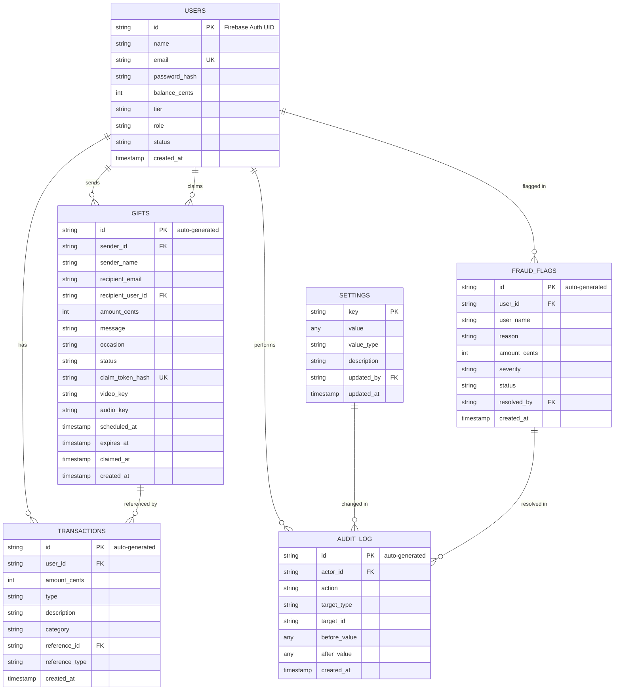

# UniCredit (Stitch) -- Data Models

**Version:** 3.0
**Date:** 2026-03-17
**Status:** Draft
**Author:** Solution Architect Agent

---

## 1. Overview

All data is stored in Firebase Firestore. Each section defines a collection with its document schema, field types, constraints, defaults, indexes, and relationships.

**Key Conventions:**
- All monetary values are **integer cents** (e.g., `$12.50` = `1250`).
- All timestamps are **ISO 8601 strings** (Firestore Timestamp type).
- Document IDs are either Firebase Auth UIDs (users) or auto-generated (everything else).
- Soft deletes are used where applicable (via `status` or `deleted_at` fields).
- All user-provided strings are sanitized (HTML entities escaped) before storage.

---

## 2. Users Collection

**Collection path:** `users`
**Document ID:** Firebase Auth UID (e.g., `"abc123xyz"`)

### Schema

| Field | Type | Required | Default | Constraints | Description |
|-------|------|----------|---------|-------------|-------------|
| `name` | string | Yes | Email prefix | Max 100 chars, sanitized | Display name |
| `email` | string | Yes | - | Valid email, max 254 chars, unique | Account email |
| `password_hash` | string | Yes | - | bcrypt hash (12 rounds); empty string for Google auth | Password hash |
| `balance_cents` | number (integer) | Yes | `0` | >= 0 | Wallet balance in cents |
| `tier` | string | Yes | `"STANDARD"` | Enum: `"STANDARD"`, `"GOLD"`, `"PLATINUM"` | Loyalty tier |
| `role` | string | Yes | `"user"` | Enum: `"user"`, `"admin"` | Authorization role |
| `status` | string | Yes | `"active"` | Enum: `"active"`, `"suspended"` | Account status |
| `photo_url` | string | No | `null` | Valid URL or empty string | Profile photo URL |
| `auth_provider` | string | Yes | `"email"` | Enum: `"email"`, `"google"` | Authentication method |
| `notification_preferences` | map | Yes | `{email: true, push: false}` | See sub-schema | Notification settings |
| `fcm_tokens` | array of string | Yes | `[]` | Max 10 tokens | Push notification device tokens |
| `reset_token_hash` | string | No | `null` | SHA-256 hash | Hashed password reset token |
| `reset_token_expires_at` | timestamp | No | `null` | Must be in the future when set | Reset token expiry |
| `suspended_at` | timestamp | No | `null` | Set when status = suspended | Suspension timestamp |
| `suspended_by` | string | No | `null` | References users (admin ID) | Admin who suspended |
| `suspended_reason` | string | No | `null` | Max 500 chars, sanitized | Reason for suspension |
| `created_at` | timestamp | Yes | Server timestamp | Immutable after creation | Account creation time |
| `updated_at` | timestamp | Yes | Server timestamp | Updated on every write | Last modification time |
| `last_login_at` | timestamp | No | `null` | Updated on each login | Most recent login time |

### Notification Preferences Sub-Schema

| Field | Type | Default | Description |
|-------|------|---------|-------------|
| `email` | boolean | `true` | Receive email notifications |
| `push` | boolean | `false` | Receive push notifications |

### Indexes

| Index | Type | Purpose |
|-------|------|---------|
| `email` | Single field, ascending | Login lookups, duplicate checking |
| `status` | Single field, ascending | Admin user listing with status filter |
| `created_at` | Single field, descending | Admin user listing, sorted by newest |
| `(status, created_at)` | Composite | Admin paginated user list filtered by status |
| `(tier, created_at)` | Composite | Tier-based queries (future rewards) |
| `(role, status)` | Composite | Admin user queries |

### Relationships

| Relationship | Target Collection | Cardinality | Enforcement |
|-------------|-------------------|-------------|-------------|
| Owns transactions | `transactions` | 1:N | `transactions.user_id` → `users.{docId}` |
| Sends gifts | `gifts` | 1:N | `gifts.sender_id` → `users.{docId}` |
| Receives gifts | `gifts` | 1:N | `gifts.recipient_user_id` → `users.{docId}` |
| Has fraud flags | `fraud_flags` | 1:N | `fraud_flags.user_id` → `users.{docId}` |
| Performs admin actions | `audit_log` | 1:N | `audit_log.actor_id` → `users.{docId}` |

### Security Rules

- `password_hash` is NEVER returned in API responses.
- `role` can only be changed directly in the database (not via any API endpoint).
- `balance_cents` is only modified via `FieldValue.increment()` inside Firestore transactions.

---

## 3. Transactions Collection

**Collection path:** `transactions`
**Document ID:** Auto-generated

### Schema

| Field | Type | Required | Default | Constraints | Description |
|-------|------|----------|---------|-------------|-------------|
| `user_id` | string | Yes | - | References `users` document | Owner of this transaction |
| `amount_cents` | number (integer) | Yes | - | Non-zero integer; positive for credits, negative for debits | Transaction amount in cents |
| `type` | string | Yes | - | Enum: `"credit"`, `"debit"` | Transaction direction |
| `description` | string | Yes | - | Max 500 chars, sanitized | Human-readable description |
| `category` | string | Yes | `"general"` | Enum: `"gift_card"`, `"gift_sent"`, `"gift_received"`, `"gift_refund"`, `"top_up"`, `"general"` | Transaction category |
| `reference_id` | string | No | `null` | References gifts or Stripe sessions | ID of related entity |
| `reference_type` | string | No | `null` | Enum: `"gift"`, `"stripe_session"`, `null` | Type of related entity |
| `created_at` | timestamp | Yes | Server timestamp | Immutable | Transaction time |

### Indexes

| Index | Type | Purpose |
|-------|------|---------|
| `(user_id, created_at DESC)` | Composite | Paginated transaction history per user |
| `(user_id, category, created_at DESC)` | Composite | Filtered transaction history per user |
| `(user_id, type, created_at DESC)` | Composite | Credit/debit filter per user |
| `created_at DESC` | Single field | Admin global transaction queries |
| `(category, created_at DESC)` | Composite | Admin category-based queries |

### Relationships

| Relationship | Target Collection | Cardinality | Enforcement |
|-------------|-------------------|-------------|-------------|
| Belongs to user | `users` | N:1 | `user_id` → `users.{docId}` |
| References gift | `gifts` | N:0..1 | `reference_id` → `gifts.{docId}` (when `reference_type = "gift"`) |

### Data Integrity Rules

- `amount_cents` sign must match `type`: positive for `"credit"`, negative for `"debit"`.
- `amount_cents` must never be zero.
- Every balance modification (`FieldValue.increment`) must have a corresponding transaction record created atomically in the same Firestore transaction.

---

## 4. Gifts Collection

**Collection path:** `gifts`
**Document ID:** Auto-generated

### Schema

| Field | Type | Required | Default | Constraints | Description |
|-------|------|----------|---------|-------------|-------------|
| `sender_id` | string | Yes | - | References `users` | ID of the gift sender |
| `sender_name` | string | Yes | - | Max 100 chars | Denormalized sender display name |
| `recipient_email` | string | Yes | - | Valid email, max 254 chars | Recipient's email address |
| `recipient_user_id` | string | No | `null` | References `users` | Set when gift is claimed |
| `amount_cents` | number (integer) | Yes | - | > 0, <= 5000000 | Gift value in cents |
| `message` | string | Yes | `"Enjoy your gift!"` | Max 2000 chars, sanitized | Personal message from sender |
| `occasion` | string | No | `null` | Max 100 chars, sanitized | Gift occasion label |
| `status` | string | Yes | `"pending"` | Enum: `"pending"`, `"claimed"`, `"expired"` | Gift lifecycle status |
| `claim_token` | string | Yes | UUID v4 | Unique, 36 chars | Token for claiming (sent in email) |
| `claim_token_hash` | string | Yes | SHA-256 | Unique | Hash of claim_token (for secure lookup) |
| `video_key` | string | No | `null` | GCS object key pattern: `gifts/{userId}/*` | Video attachment storage key |
| `audio_key` | string | No | `null` | GCS object key pattern: `gifts/{userId}/*` | Audio attachment storage key |
| `scheduled_at` | timestamp | No | `null` | Must be in the future when set | Scheduled delivery time |
| `notification_sent_at` | timestamp | No | `null` | Set when notification is sent | Time notification email was sent |
| `claimed_at` | timestamp | No | `null` | Set when status = claimed | Time gift was claimed |
| `expires_at` | timestamp | Yes | `created_at + 90 days` | Must be after created_at | Gift expiration time |
| `created_at` | timestamp | Yes | Server timestamp | Immutable | Gift creation time |
| `updated_at` | timestamp | Yes | Server timestamp | Updated on every write | Last modification time |

### Indexes

| Index | Type | Purpose |
|-------|------|---------|
| `claim_token_hash` | Single field, ascending | Gift claim lookup (unique) |
| `(sender_id, created_at DESC)` | Composite | Sender's gift history |
| `(recipient_email, status)` | Composite | Recipient's pending gifts |
| `(status, expires_at ASC)` | Composite | Expiration job: find expired pending gifts |
| `(status, scheduled_at ASC)` | Composite | Scheduled delivery job: find due gifts |
| `(recipient_user_id, created_at DESC)` | Composite | Recipient's claimed gift history |

### Relationships

| Relationship | Target Collection | Cardinality | Enforcement |
|-------------|-------------------|-------------|-------------|
| Sent by user | `users` | N:1 | `sender_id` → `users.{docId}` |
| Claimed by user | `users` | N:0..1 | `recipient_user_id` → `users.{docId}` |
| Has sender transaction | `transactions` | 1:1 | Transaction with `reference_id` = gift ID, category = `"gift_sent"` |
| Has recipient transaction | `transactions` | 0..1:1 | Transaction with `reference_id` = gift ID, category = `"gift_received"` |
| Has refund transaction | `transactions` | 0..1:1 | Transaction with `reference_id` = gift ID, category = `"gift_refund"` |

### Lifecycle State Machine

```
                  ┌──────────┐
                  │  pending  │
                  └──┬───┬───┘
                     │   │
          ┌──────────┘   └──────────┐
          ▼                         ▼
    ┌──────────┐             ┌──────────┐
    │ claimed  │             │ expired  │
    └──────────┘             └──────────┘
```

Transitions:
- `pending` → `claimed`: Recipient claims the gift. `recipient_user_id` and `claimed_at` are set.
- `pending` → `expired`: Background job detects `expires_at` <= now. Sender is refunded.
- `claimed` and `expired` are terminal states -- no further transitions.

### Security Notes

- `claim_token` is stored but NEVER returned in list queries. It is only used in the claim URL.
- `claim_token_hash` (SHA-256) is used for database lookups to avoid storing the raw token in queries.
- Media keys are validated against the pattern `gifts/{senderId}/*` to prevent IDOR on media access.

---

## 5. Fraud Flags Collection

**Collection path:** `fraud_flags`
**Document ID:** Auto-generated

### Schema

| Field | Type | Required | Default | Constraints | Description |
|-------|------|----------|---------|-------------|-------------|
| `user_id` | string | Yes | - | References `users` | Flagged user's ID |
| `user_name` | string | Yes | - | Max 100 chars | Denormalized user name |
| `user_email` | string | Yes | - | Max 254 chars | Denormalized user email |
| `reason` | string | Yes | - | Max 500 chars | Human-readable flag reason |
| `amount_cents` | number (integer) | No | `null` | >= 0 | Related transaction amount (if applicable) |
| `severity` | string | Yes | - | Enum: `"low"`, `"medium"`, `"high"`, `"critical"` | Flag severity level |
| `status` | string | Yes | `"open"` | Enum: `"open"`, `"reviewing"`, `"resolved"`, `"blocked"` | Flag resolution status |
| `resolved_by` | string | No | `null` | References `users` (admin) | Admin who resolved the flag |
| `resolved_at` | timestamp | No | `null` | Set when status becomes resolved/blocked | Resolution timestamp |
| `resolution_notes` | string | No | `null` | Max 1000 chars, sanitized | Admin notes on resolution |
| `created_at` | timestamp | Yes | Server timestamp | Immutable | Flag creation time |
| `updated_at` | timestamp | Yes | Server timestamp | Updated on every write | Last modification time |

### Indexes

| Index | Type | Purpose |
|-------|------|---------|
| `(status, severity DESC, created_at DESC)` | Composite | Admin dashboard: open flags sorted by severity |
| `(status, created_at DESC)` | Composite | Admin paginated flag list |
| `(user_id, created_at DESC)` | Composite | Per-user fraud history |

### Status Transitions

```
    ┌────────┐
    │  open  │
    └──┬──┬──┘
       │  │
  ┌────┘  └────┐
  ▼            ▼
┌───────────┐ ┌──────────┐
│ reviewing │ │ resolved │
└─────┬─────┘ └──────────┘
      │
  ┌───┴───┐
  ▼       ▼
┌────────┐ ┌──────────┐
│resolved│ │ blocked  │
└────────┘ └──────────┘
```

- `open` → `reviewing`: Admin starts reviewing.
- `open` → `resolved`: Admin resolves without blocking.
- `reviewing` → `resolved`: Admin clears the flag after review.
- `reviewing` → `blocked`: Admin blocks the user.
- `blocked`: User account is suspended + flag resolved.

---

## 6. Settings Collection

**Collection path:** `settings`
**Document ID:** Setting key (e.g., `"exchange_rate"`)

### Schema

| Field | Type | Required | Default | Constraints | Description |
|-------|------|----------|---------|-------------|-------------|
| `key` | string | Yes | - | Document ID; max 100 chars | Setting identifier |
| `value` | any | Yes | - | Type varies by key (see below) | Setting value |
| `value_type` | string | Yes | - | Enum: `"number"`, `"boolean"`, `"string"`, `"integer"` | Expected value type for validation |
| `description` | string | Yes | - | Max 500 chars | Human-readable description |
| `updated_at` | timestamp | Yes | Server timestamp | Updated on every write | Last modification time |
| `updated_by` | string | Yes | `"system"` | References `users` or `"system"` | Who last modified |

### Known Settings

| Key | Value Type | Default | Constraints | Description |
|-----|-----------|---------|-------------|-------------|
| `exchange_rate` | number | `0.9` | 0.01 - 1.0 | Gift card to UniCredit exchange rate |
| `global_rate_lock` | boolean | `false` | - | Whether exchange rate is globally locked |
| `standard_spread` | integer | `291` | 0 - 10000 | Standard spread in basis points |
| `gift_expiration_days` | integer | `90` | 1 - 365 | Days until unclaimed gifts expire |
| `max_gift_amount_cents` | integer | `5000000` | 100 - 10000000 | Maximum gift amount in cents |
| `max_conversion_amount_cents` | integer | `5000000` | 100 - 10000000 | Maximum conversion amount in cents |

### Notes

- Settings are cached in Redis with a 5-minute TTL to reduce Firestore reads.
- Every setting change is audit-logged (see Audit Log collection).
- The `value_type` field is used by the admin settings endpoint to validate incoming values.

---

## 7. Audit Log Collection

**Collection path:** `audit_log`
**Document ID:** Auto-generated

### Schema

| Field | Type | Required | Default | Constraints | Description |
|-------|------|----------|---------|-------------|-------------|
| `actor_id` | string | Yes | - | References `users` (admin) | Admin who performed the action |
| `actor_email` | string | Yes | - | Denormalized | Admin's email (for display) |
| `action` | string | Yes | - | See action catalog below | Action performed |
| `target_type` | string | Yes | - | Enum: `"user"`, `"setting"`, `"fraud_flag"`, `"gift"` | Type of affected entity |
| `target_id` | string | Yes | - | Document ID of target | ID of affected entity |
| `before_value` | any | No | `null` | JSON-serializable | State before the action |
| `after_value` | any | No | `null` | JSON-serializable | State after the action |
| `ip_address` | string | Yes | - | IPv4 or IPv6 | Request source IP |
| `request_id` | string | Yes | - | UUID v4 | Correlation ID from request |
| `created_at` | timestamp | Yes | Server timestamp | Immutable | Action timestamp |

### Action Catalog

| Action | Target Type | Description |
|--------|------------|-------------|
| `update_setting` | setting | Admin changed a platform setting |
| `suspend_user` | user | Admin suspended a user account |
| `reinstate_user` | user | Admin reinstated a suspended user |
| `update_user_tier` | user | Admin changed a user's tier |
| `resolve_fraud_flag` | fraud_flag | Admin resolved a fraud flag |
| `block_fraud_flag` | fraud_flag | Admin blocked user via fraud flag |
| `review_fraud_flag` | fraud_flag | Admin started reviewing a fraud flag |

### Indexes

| Index | Type | Purpose |
|-------|------|---------|
| `created_at DESC` | Single field | Paginated audit log (most recent first) |
| `(actor_id, created_at DESC)` | Composite | Per-admin action history |
| `(target_type, target_id, created_at DESC)` | Composite | Per-entity change history |
| `(action, created_at DESC)` | Composite | Filter by action type |

### Retention

- Audit log entries are retained indefinitely (regulatory compliance).
- No soft delete on audit logs -- they are append-only.
- Post-MVP: consider archiving entries older than 2 years to a separate collection or cold storage.

---

## 8. Meta Collection

**Collection path:** `_meta`
**Document ID:** Fixed keys

### Schema (document: `initialized`)

| Field | Type | Description |
|-------|------|-------------|
| `initialized_at` | timestamp | When the database was first initialized |
| `version` | string | Schema version (e.g., `"3.0.0"`) |
| `collections` | array of string | List of initialized collections |
| `migration_history` | array of map | List of migrations applied |

### Migration History Entry

```json
{
  "version": "3.0.0",
  "description": "Migrate float balances to integer cents",
  "applied_at": "2026-03-17T14:30:00.000Z",
  "applied_by": "migration_script",
  "status": "completed",
  "records_affected": 1247,
  "reconciliation": {
    "max_diff_cents": 1,
    "users_with_diff": 3
  }
}
```

---

## 9. Processed Sessions (Redis)

**Not a Firestore collection.** Stored in Redis for performance.

### Structure

```
Type: Redis SET or individual keys with TTL

Option A (Set):
  Key: processed_sessions
  Members: Stripe session IDs
  (Requires manual TTL management)

Option B (Individual Keys — Recommended):
  Key pattern: processed_session:{sessionId}
  Value: "1"
  TTL: 86400 seconds (24 hours)
```

Option B is preferred because Redis automatically handles expiration per key, eliminating the need for a cleanup job.

### Operations

| Operation | Redis Command | Purpose |
|-----------|--------------|---------|
| Check if processed | `EXISTS processed_session:{sessionId}` | Before crediting user |
| Mark as processed | `SET processed_session:{sessionId} 1 EX 86400` | After crediting user |

---

## 10. Migration Strategy: Float to Integer Cents

### 10.1 Overview

The current database stores all monetary values as floating-point numbers (e.g., `1240.50`). These must be migrated to integer cents (e.g., `124050`).

### 10.2 Migration Steps

**Step 1: Add new fields (non-breaking)**

Add `balance_cents` to every user document:
```javascript
// For each user document
const balanceCents = Math.round(user.balance * 100);
await userRef.update({ balance_cents: balanceCents });
```

Add `amount_cents` to every transaction document:
```javascript
// For each transaction document
const amountCents = Math.round(transaction.amount * 100);
await txRef.update({ amount_cents: amountCents });
```

Add `amount_cents` to every gift document:
```javascript
// For each gift document
const amountCents = Math.round(gift.amount * 100);
await giftRef.update({ amount_cents: amountCents });
```

**Step 2: Dual-write period**

For 1 week, all write operations update BOTH fields:
```javascript
// In wallet service
await userRef.update({
  balance: admin.firestore.FieldValue.increment(amountDollars),
  balance_cents: admin.firestore.FieldValue.increment(amountCents),
});
```

**Step 3: Switch reads**

API responses switch from `balance`/`amount` to `balanceCents`/`amountCents`. Frontend is updated to expect cents.

**Step 4: Reconciliation report**

```javascript
async function reconcile() {
  const users = await db.collection('users').get();
  let maxDiffCents = 0;
  let usersWithDiff = 0;

  for (const doc of users.docs) {
    const data = doc.data();
    const expectedCents = Math.round(data.balance * 100);
    const actualCents = data.balance_cents;
    const diff = Math.abs(expectedCents - actualCents);
    if (diff > 0) {
      usersWithDiff++;
      maxDiffCents = Math.max(maxDiffCents, diff);
      console.log(`User ${doc.id}: expected=${expectedCents}, actual=${actualCents}, diff=${diff}`);
    }
  }

  console.log(`Reconciliation: ${usersWithDiff} users with diff, max diff = ${maxDiffCents} cents`);
}
```

**Step 5: Remove old fields**

After reconciliation confirms zero discrepancies:
```javascript
// Batch update to remove float fields
await userRef.update({
  balance: admin.firestore.FieldValue.delete(),
});
```

### 10.3 Risk Mitigation

- **Freeze transactions during migration:** Not required because dual-write ensures consistency.
- **Rounding:** `Math.round()` ensures $0.005 rounds to 1 cent, $0.004 rounds to 0 cents. Maximum rounding error is 0.5 cents per value.
- **Rollback plan:** If reconciliation shows unacceptable drift, revert API to read float fields, investigate discrepancies.

---

## 11. Soft Delete Strategy

### Policy

No data is permanently deleted from user-facing collections. Instead, records transition to terminal states:

| Collection | Soft Delete Mechanism | Terminal States |
|------------|----------------------|-----------------|
| Users | `status: "suspended"` | `"suspended"` (reversible by admin) |
| Gifts | `status: "expired"` or `status: "claimed"` | `"expired"`, `"claimed"` |
| Fraud Flags | `status: "resolved"` or `status: "blocked"` | `"resolved"`, `"blocked"` |
| Transactions | N/A (never deleted) | N/A |
| Audit Log | N/A (never deleted, append-only) | N/A |
| Settings | N/A (overwritten, history in audit log) | N/A |

### Data Retention

| Collection | Retention Period | Archive Strategy |
|------------|-----------------|------------------|
| Users | Indefinite | None |
| Transactions | Indefinite | Archive to cold storage after 2 years (post-MVP) |
| Gifts | Indefinite (claimed/expired remain queryable) | Archive expired gifts after 1 year |
| Fraud Flags | Indefinite | None (compliance) |
| Audit Log | Indefinite | None (compliance) |
| Processed Sessions (Redis) | 24 hours | Automatic TTL expiry |

### GDPR / Data Deletion (Post-MVP)

When a user requests account deletion:
1. Anonymize user document: replace name with "Deleted User", email with hashed value, clear photo_url.
2. Set `status: "deleted"`, `deleted_at: now`.
3. Retain transaction and audit records (anonymized) for financial compliance.
4. Delete media files (video/audio) from GCS.
5. Remove FCM tokens.
6. This is a post-MVP requirement tracked as a COULD HAVE feature.

---

## 12. Entity Relationship Diagram


